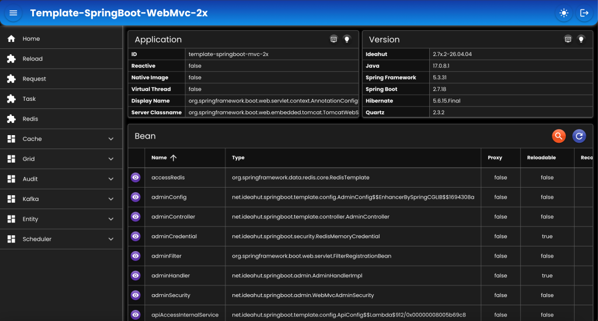

# Template SpringBoot WebMvc 2x&nbsp;&nbsp;&nbsp;

### [Dokumentasi](https://github.com/ideahut-apps-team/Ideahut-Spring-Boot)

##

|Artifact|Spring Boot|
|:---------:|:----------:|
|__ideahut-springboot-2x__|<small>(wajib di semua spring boot versi 2)</small>|
|ideahut-springboot-2.4x.1|__2.4.0 - 2.4.13__|
|ideahut-springboot-2.5x.1|__2.5.0 - 2.5.15__|
|ideahut-springboot-2.6x.1|__2.6.0 - 2.6.15__<br/><small>(_kecuali: 2.6.2, 2.6.3, 2.6.4_)</small>|
|ideahut-springboot-2.7x.1|__2.7.0 - 2.7.9__|
|ideahut-springboot-2.7x.2|__2.7.10 - 2.7.18__|

##

### Untuk mencoba versi Spring Boot tertentu:
* Rename pom-2.xx.x.xml menjadi menjadi __pom.xml__.
    ```yaml
    pom-2.4x.1.xml
    pom-2.5x.1.xml
    pom-2.6x.1.xml
    pom-2.7x.1.xml
    pom-2.7x.2.xml
    ```
* Pastikan artifact yang digunakan sesuai dengan versi Spring Boot (lihat tabel artifact di atas).
* Edit file __pom.xml__ dengan mengubah versi __'spring-boot-starter-parent'__ sesuai dengan versi yang diinginkan.
    ```xml
    <parent>
		<groupId>org.springframework.boot</groupId>
		<artifactId>spring-boot-starter-parent</artifactId>
		<version>2.7.18</version> <!-- Ubah bagian ini -->
		<relativePath/>
	</parent>
    ```
##

### Untuk mencoba database tertentu:
* Ubah properties __'spring.profiles.active'__ sesuai dengan database yang diinginkan.
    ```yaml
    spring:
        profiles:
            #active: "db2"
            #active: "derby"
            #active: "h2"
            #active: "hsql"
            #active: "mariadb"
            active: "mysql"
            #active: "oracle"
            #active: "postgresql"
            #active: "sqlserver"
    ```
* Edit file __'application-{profile}.yaml'__, pastikan host, port, username, dan password sesuai dengan server database yang digunakan.
    ```yaml
    application-db2.yaml
    application-derby.yaml
    application-h2.yaml
    application-hsql.yaml
    application-mariadb.yaml
    application-mysql.yaml
    application-oracle.yaml
    application-postgresql.yaml
    application-sqlserver.yaml
    ```
##

### Admin
- `URL`  : http://localhost:5401/_/web
- `User` : admin
- `Pass` : password
<div align="left">
   
</div>

##

### Template

* [Springboot 3x WebMvc](https://github.com/ideahut-apps-team/Template-SpringBoot-WebMvc-3x)
* [Springboot 3x WebFlux](https://github.com/ideahut-apps-team/Template-SpringBoot-WebFlux-3x)
* [Springboot 2x WebMvc](https://github.com/ideahut-apps-team/Template-SpringBoot-WebMvc-2x)
* [Springboot 2x WebFlux](https://github.com/ideahut-apps-team/Template-SpringBoot-WebFlux-2x)